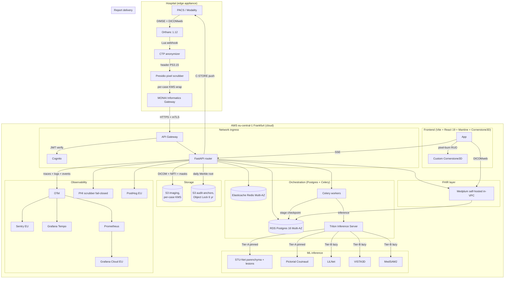

# LiverRa — Architecture Overview

> **Status:** v1 MVP architecture (2026-04-19)
> **Owners:** Eng leads (backend, ML, frontend, SRE)
> **Scope:** Zero-training cascaded pipeline, edge + cloud split, GDPR-compliant EU-only deployment

---

## Plain-English summary

LiverRa has two homes: the **edge** (inside the hospital) and the
**cloud** (our AWS account in Frankfurt). The edge handles raw DICOM,
strips identifying info, and encrypts per-case before a single byte
leaves the hospital network. The cloud runs the AI pipeline, stores
encrypted results, and serves the web UI + reports.

Think of it like a letter that gets sealed inside an envelope at the
post office (edge), shipped across the border (encrypted), then opened
in a reading room where only cleared staff can see the contents (cloud
with audit chain).

---

## High-level architecture

---

## Data flow: upload → finalize → PACS push

1. **Upload (edge)**: Modality sends DICOM to Orthanc via DIMSE. Orthanc's
   Lua `ReceivedInstanceFilter` hook fires a webhook to the
   anonymization sidecar.
2. **Anonymize (edge)**: CTP strips PS3.15 headers; Presidio redacts
   pixel-burned PHI from corners/strip (fast path) or full image
   (Secondary Capture). Per-case KMS DEK wraps the anonymized bytes
   before upload.
3. **Ingress (cloud)**: MIG pushes to our API Gateway over mTLS.
   FastAPI validates the JWT (Cognito), records ingestion in the
   audit chain, stores ciphertext in S3.
4. **Cascade (cloud)**: Celery orchestrates 7 stages — anonymization
   verify → parenchyma → lesion detection → Couinaud → vessels →
   classification fan-out → FLR calc. Each stage writes a
   `pipeline_checkpoint` row in the same Postgres transaction that
   releases its GPU lease (research §X.2).
5. **SSE (cloud → frontend)**: As each stage completes, an SSE event
   emits to the UI. Reviewer can take a seat, refine masks (VISTA3D
   click + MedSAM-2 prompt), override classifications.
6. **Finalize (cloud)**: Step-up MFA; the analysis becomes immutable.
   WeasyPrint renders the PDF (five-layer RUO pixel-burn). DICOM-SEG
   + DICOM-SR are packaged with the MBoM-stamped model version.
7. **Delivery (cloud → hospital)**: FastAPI pushes C-STORE via
   `pynetdicom`. Postgres `ReportDelivery` state machine tracks
   pending → sending → acknowledged/failed → manual-fallback.

---

## ADR index

Every major architecture choice has an ADR in the `adr/` subfolder.
Each ADR is numbered, dated, and follows the standard Context /
Decision / Consequences / Alternatives structure.

| # | Title | Status | Related research |
|---|---|---|---|
| [0001](./adr/0001-cascaded-not-ensemble.md) | Cascaded Celery orchestration, not Triton ensemble | Accepted | §C.2 |
| [0002](./adr/0002-medplum-self-hosted.md) | Medplum self-hosted in-VPC, not Medplum Cloud | Accepted | §A.2 |
| [0003](./adr/0003-per-tenant-linear-hash-chain.md) | Per-tenant linear hash chain + daily Merkle anchor | Accepted | §A.3 |
| [0004](./adr/0004-custom-cornerstone3d-not-ohif.md) | Custom Cornerstone3D shell, not OHIF Viewer v3 | Accepted | §C.4 |
| [0005](./adr/0005-per-case-kms-crypto-shred.md) | Per-case KMS CMK + `ScheduleKeyDeletion` for crypto-shred | Accepted | §X.1 |

Future ADRs will be added as new decisions land; numbering is
monotonic and immutable. A rejected decision is marked **Superseded
by ADR-####** rather than deleted.

---

## Sub-system deep-dives

Pointers to the sub-system docs that expand on the overview:

- **Edge appliance + Orthanc + CTP**: `deploy/README.md` + research §B.1–B.3
- **Celery cascade + Triton VRAM policy**: research §C.1–C.3
- **FHIR extensions + Medplum bootstrap**: `packages/fhirtypes/README.md`
- **Audit chain verifier**: research §A.3, §X.4; code under
  `packages/ml-inference/src/services/audit/`
- **Frontend shell + viewer**: `packages/app/src/emr/README.md`
- **Observability + PHI scrubber**: research §A.6; config under
  `packages/ml-inference/src/observability/`

---

## Non-goals / out-of-scope for v1

The architecture deliberately omits:

- **Training infrastructure** — v1 is zero-training; pretrained
  Apache-2.0 weights only. Fine-tuning runs out-of-band on a separate
  cluster and lands in v2.
- **Multi-region** — eu-central-1 only for GDPR residency. US/UK
  expansion (v2) will require a regulatory and data-residency review.
- **Kubernetes** — docker-compose on a single VM per tenant is
  sufficient for MVP. EKS migration is gated on 3+ paying customers
  per plan §Infrastructure.
- **Full EHR integration** — read-only PACS push is in scope; HL7v2
  ORU / FHIR push to hospital EHRs is v2.

---

## Change control

Architecture changes require:

1. An ADR under `adr/`, following the numbered format.
2. A PR that updates this overview to reference the new ADR.
3. Two-reviewer approval per the Constitution's Code Review gate.
